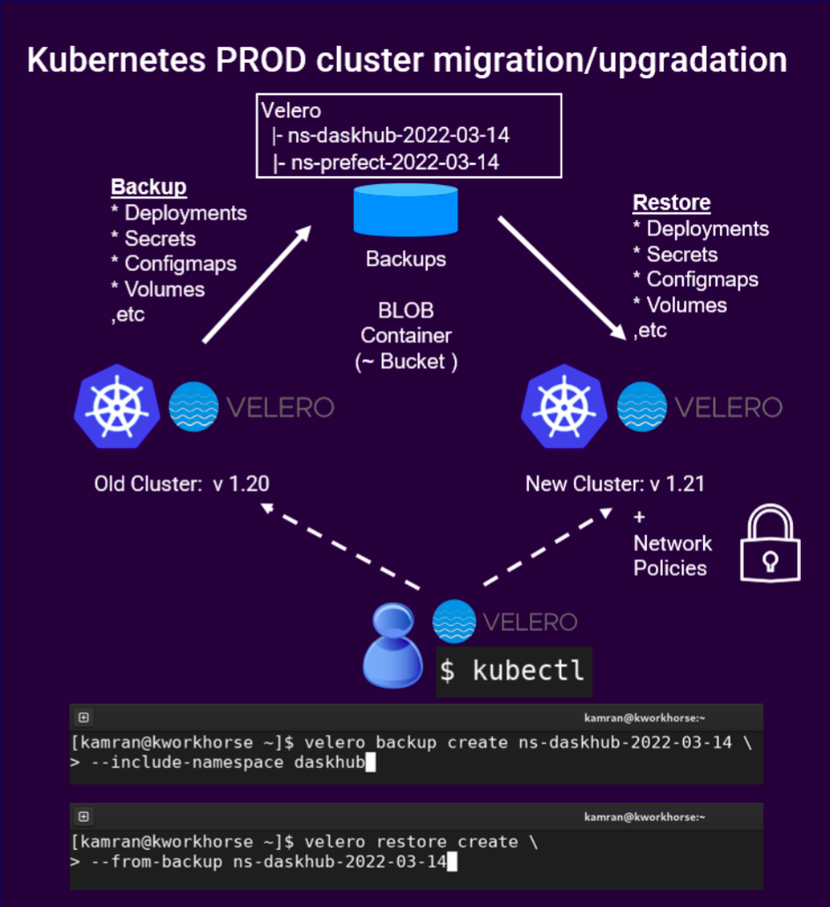

# Kubernetes backup, restore and migration with Velero - on Azure

* Author: Kamran Azeem
* Created: 20 Feb 2022


**Note:** This is an engineering blog, and contains a lot of technical details.

## Introduction:

Until sometime ago, Kubernetes backup and restore used to be very challenging and involved process. However, with [Velero](https://velero.io) it is now almost a piece of cake!

Consider a situation where you have a Kubernetes cluster, which you would like to upgrade/migrate to a newer cluster with newer configuration. In that case, you would like to save the complete state of each namespace, especially the precious persistent data stored in the persistent volumes, and take it to the new cluster. Velero can help you with that. It (Velero) does this by using bucket/BLOB storage in the cloud. It takes snapshots of your PV and PVCs, and stores them in the bucket store. It also takes snapshots of various other objects, such as deployments, statefulsets, daemonsets, configmaps, secrets, etc. Once a newer cluster is setup and Velero is configured to talk to the new kubenretes cluster, you can restore all of these objects in the new cluster, thus making this upgradation/migration process a breeze. Normally the backup is performed on a namespace level. i.e. You simply take full backup of a namespace and restore the entire namespace in the new cluster.

A couple of months ago, we had a similar situation. We had a Kubernetes cluster in AKS (Azure Kubernetes Service) - which we wanted to reconfigure, but that re-configuration was only possible in a new cluster. We had some persistent data in this cluster, which needed to move to the newer cluster. This meant that we needed a backup and restore mechanism, and we found Velero to be suitable for this task. 

Below is a conceptual diagram of what is described above.



```
Old K8s cluster ---> (backup)---> BLOB storage ---> (restore) ---> New K8s cluster
          |                            |                            |
          -----------------------------------------------------------
                                       |
                              (backup-helper VM)

|<----------------------------Microsoft Cloud (Azure) ----------------------------->|    
```

**Note:** It is assumed that the old and new k8s clusters are part of the same Azure subscription.

**Note:** Although it is very much possible to setup Velero on your local/home/work computer, and get all of this done. We decided to create a dedicated VM (CENTOS 7.9) in MS cloud to handle backup and restore from several clusters. This helped us keeping the operational control at a central place instead of spreading it on every team member's computer. **Most of the steps in this document are performed on this VM - unless mentioned otherwise.** 


## Setup:
Log on to the backup-helper VM.

```
ssh velero@backup-helper.westeurope.cloudapp.azure.com
```

### Setup azure cli on the backup-helper VM:

Install and configure Azure CLI on backup-helper.
```
az login 
```

### Install kubectl on the backup-helper VM:

Follow instructions from this link: [https://kubernetes.io/docs/tasks/tools/install-kubectl-linux/](https://kubernetes.io/docs/tasks/tools/install-kubectl-linux/)

### Setup context for correct (old/src) kubernetes cluster:
In this document, we are backing up the (old/src) dev kubernetes cluster.

Setup kube context for the old PROD cluster
```
az aks get-credentials --resource-group rg-dev-kubernetes --name arck-dev-odp
```

Verify:
```
kubectl get nodes
```

### Create a separate BLOB Container:
It is important to create a separate/dedicated BLOB container for each Kubernetes cluster. This will prevent backups of different clusters from mixing up. In this case, it will be `backups-k8s-arck-dev-odp` created in the storage account named `stkubernetesbackups`. 

```
Azure Portal -> Storage Accounts -> stkubernetesbackups - Containers -> Add Container
```

**Note:** You must always have separate BLOB containers for each kubernetes cluster you want to backup.

The name of the blob container should then be set in the environment variable `AZURE_BLOB_CONTAINER`.

```
AZURE_BLOB_CONTAINER=backups-k8s-arck-dev-odp
```

Also, at this point, set up endpoint in the `stkubernetesbackups` storage account for the vnet of the above (old/src) kubernetes cluster.


### Find VNET of the above k8s cluster:

We need to be able to connect to this blob storage `backups-k8s-arck-dev-odp`, in the selected storage account `stkubernetesbackups`, from two selected VNets. i.e. One from the SRC kubenretes cluster and the other from the DST kubernetes cluster. Later, we can add more VNets to the list of allowed VNets if required.

So, we find those vnets and setup the endpoints for this storageAccount in each vnet. This can be done in Azure portal. 

**Note:** The location of vnet depends on what networking plugin was used during the cluster creation. 

**Clusters with Kubenet:**
```
Azure Portal -> ResourceGroups -> (look for resourceGroups with "MC_" prefix)
```

Click on that, and then you will see the name of the VNET in the list of resources which are under this resourceGroup.

* For our SRC cluster, this is "aks-vnet-40499165"
* For our DST cluster, it is unknown , as the new cluster is not created yet.

**Clusters with Azure CNI:**

```
Azure Portal -> Kubernetes Service -> arck-dev-odp -> rg-dev-kubernetes -> arck-dev-odp-network
```
So in this case the vnet will be `arck-dev-odp-network`.


Now, go to storage account and then create an endpoint in that vnet. The actual endpoint will actually be created in a subnet of that vnet.

```
Azure Portal -> Storage Accounts -> stkubernetesbackups -> Security + Networking -> Networking -> Add existing virtual network. 
```
Make sure to "save settings" in Azure portal.

**Note:** Enabling access will take up to 15 minutes to complete.

Also, you need to add IP of the helper VM (`20.105.152.183`) to the StorageAccount firewall. Remember that our velero helper VM is in a separate VNET, so we need to create a storage endpoint in velero VM's vnet as well (mandatory). This is especially useful when we check `velero logs`, from the VM. If this is not setup correctly, `velero logs` command will result in error, as shown below.

```
[velero@backup-helper ~]$ velero backup logs ns-daskhub-backup-2022-03-07
An error occurred: request failed: <?xml version="1.0" encoding="utf-8"?><Error><Code>AuthorizationFailure</Code><Message>This request is not authorized to perform this operation.
RequestId:48232a78-301e-007a-47bf-32f7ee000000
Time:2022-03-08T07:36:43.8275952Z</Message></Error>
[velero@backup-helper ~]$
```

Save settings in Azure portal.


## Set permissions for Velero

Since we want to use Velero to take Azure snapshots of our persistent volume managed disks, we must use either of the **"service principal"** or **"AAD Pod Identity"** methods. We can't use the **"storage account access key"** method.

**Note:** We will use the "Service Principal" method.

### Create service principal:

First, obtain your Azure Account Subscription ID and Tenant ID:

```
AZURE_SUBSCRIPTION_ID=$(az account list --query '[?isDefault].id' -o tsv)
AZURE_TENANT_ID=$(az account list --query '[?isDefault].tenantId' -o tsv)
```

Now, create a **service principal** with "Contributor" role. This will have subscription-wide access, so we need to keep it safe and secure. This service principal will act as a client when talking to Blob containers inside Azure StorageAccount.

Create service principal (a "client", with name, id and password/secret) using the following command. The CLI will  generate a password for you. Make sure to make a note of it.

**Note:** Ensure that value for `--name` does not conflict with other service principals/app registrations.

```
AZURE_CLIENT_SECRET=$(az ad sp create-for-rbac \
  --name "velero-k8s-backup-helper" \
  --role "Contributor" \
  --query 'password' \
  -o tsv \
  --scopes  /subscriptions/${AZURE_SUBSCRIPTION_ID})
```

OR (use a better/clearer variable name)

```
AZURE_SERVICE_PRINCIPAL_SECRET=$(az ad sp create-for-rbac \
  --name "velero-k8s-backup-helper" \
  --role "Contributor" \
  --query 'password' \
  -o tsv \
  --scopes  /subscriptions/${AZURE_SUBSCRIPTION_ID})
```

**Note:** Make sure to make a note of the secret at a safe place. This secret is later used as AZURE_CLIENT_SECRET.


After creating the service principal, obtain the client id.

```
$ AZURE_CLIENT_ID=$(az ad sp list \
  --display-name "velero-k8s-backup-helper" \
  --query '[0].appId' \
  -o tsv)

$ echo $AZURE_CLIENT_ID
```

OR (use a better/clearer variable name)

```
$ AZURE_SERVICE_PRINCIPAL_ID=$(az ad sp list \
  --display-name "velero-k8s-backup-helper" \
  --query '[0].appId' \
  -o tsv)

$ echo $AZURE_SERVICE_PRINCIPAL_ID
```

**Note:** AZURE_SERVICE_PRINCIPAL_ID is used as AZURE_CLIENT_ID later.


## Get resource group containing your VMs and disks:

On AKS, the main Kubernetes cluster "service" exists in the resourceGroup *"we"* created. i.e. "rg-dev-kubernetes". However, Azure would have auto-generated/auto-created a new/separate resource group for our kubernetes cluster, named: `MC_rg-dev-kubernetes_arck-dev-odp_westeurope`

**Note:** The new resourceGroup always have the name in this format: **"MC_<RG>_<CLUSTERNAME>_<REGION>"**

AZURE_RESOURCE_GROUP must be set to the name of this *auto-generated* resource group.

Why MS does this "MC_*" thing?, is explained here: [https://docs.microsoft.com/en-us/azure/aks/faq](https://docs.microsoft.com/en-us/azure/aks/faq)
Look for **"Why are two resource groups created with AKS?"** on this link. 

Anyhow, this resource group contains your cluster's virtual machines/disks.

* For our SRC kubernetes cluster `arck-dev-odp`, this is `MC_rg-dev-kubernetes_arck-dev-odp_westeurope` 

* For our DST kubernetes cluster, this is unknown, as the new cluster is not setup/created yet.

Set AZURE_RESOURCE_GROUP to the name of the resourceGroup of the "source" cluster:

```
AZURE_RESOURCE_GROUP=MC_rg-dev-kubernetes_arck-dev-odp_westeurope
```
OR (use a better/clearer variable name)

```
AZURE_RESOURCE_GROUP_FOR_K8S_CLUSTER=MC_rg-dev-kubernetes_arck-dev-odp_westeurope
```


### Set/verify all of the environment variables:
**Note:** This section contains manual steps to help understand what is going on. (There is no harm in performing these steps). A separate script - `velero-install.sh` - is provided in this repository to help get this done in a more controlled way. The way the script works is shown in the next step, and is what we at HubOcean recommend you to use.

On the bash shell:

```
AZURE_SUBSCRIPTION_NAME=ODP

AZURE_BACKUP_SUBSCRIPTION_NAME=${AZURE_SUBSCRIPTION_NAME}

AZURE_SUBSCRIPTION_ID=$(az account list --query '[?isDefault].id' -o tsv)

AZURE_TENANT_ID=$(az account list --query '[?isDefault].tenantId' -o tsv)

AZURE_BACKUP_SUBSCRIPTION_ID=$(az account list \
  --query="[?name=='$AZURE_BACKUP_SUBSCRIPTION_NAME'].id | [0]" \
  -o tsv)

AZURE_BACKUP_RESOURCE_GROUP=kubernetes-backups

AZURE_STORAGE_ACCOUNT_ID=stkubernetesbackups

AZURE_BLOB_CONTAINER=backups-k8s-arck-dev-odp

AZURE_SERVICE_PRINCIPAL_ID=$(az ad sp list \
  --display-name "velero-k8s-backup-helper" \
  --query '[0].appId' \
  -o tsv)

AZURE_SERVICE_PRINCIPAL_SECRET=<whatever-secret-you-got-in-previous-step>

AZURE_RESOURCE_GROUP_FOR_K8S_CLUSTER=MC_rg-dev-kubernetes_arck-dev-odp_westeurope
```

**Notes:**
* Most of the time, `AZURE_SUBSCRIPTION_ID` and `AZURE_BACKUP_SUBSCRIPTION_ID` would be same, because you would be working within the same Azure subscription.

Now create a file that contains all the relevant environment variables. Remember, the environment variables being declared in this file (on the left side of the = symbol) have special meaning for Velero. This means the name of these variables cannot be changed. However, the variables being used to assign values can have any name. This is the reason, we have used self explanatory variable names throughout this document.


Create the file for Velero:

```
cat << EOF  > ~/velero-secret-file-k8s-arck-dev-odp.env
# This top section of this file is used by velero program,
#   during install operation.

AZURE_SUBSCRIPTION_ID=${AZURE_SUBSCRIPTION_ID}
AZURE_TENANT_ID=${AZURE_TENANT_ID}
AZURE_CLIENT_ID=${AZURE_SERVICE_PRINCIPAL_ID}
AZURE_CLIENT_SECRET=${AZURE_SERVICE_PRINCIPAL_SECRET}

# This will change for each cluster you want to perform backup and restore on.
AZURE_RESOURCE_GROUP=${AZURE_RESOURCE_GROUP_FOR_K8S_CLUSTER}


AZURE_CLOUD_NAME=AzurePublicCloud

# The following variables are placed in this file, 
#   so their values are not lost after a session logout, etc.
# This way we can ensure that whenever we run velero (install) command manually,
#   the command does not fail.
AZURE_BACKUP_SUBSCRIPTION_ID=${AZURE_BACKUP_SUBSCRIPTION_ID}
AZURE_BACKUP_RESOURCE_GROUP=${AZURE_BACKUP_RESOURCE_GROUP}
AZURE_STORAGE_ACCOUNT_ID=${AZURE_STORAGE_ACCOUNT_ID}
AZURE_BLOB_CONTAINER=${AZURE_BLOB_CONTAINER}
EOF
```


Once the file is created, verify that it contains all the variables with correct values.

```
cat ~/velero-secret-file-k8s-arck-dev-odp.env
```

## Setup kubectl to talk to the SRC cluster:

You can visit Azure Portal, find the `arck-dev-odp` kubernetes cluster, and then click on connect to find the commands required for kubectl to talk to the kubernetes cluster. 

**Note:** Without this step, Velero cannot be installed in the cluster.

```
az account set --subscription 4a0dc9a4-3e6b-4da2-8c65-8a1cefc85065

az aks get-credentials --resource-group rg-dev-kubernetes --name arck-dev-odp
```


## Install velero in the SRC kubernetes cluster:

First, ensure that kubectl - on the backup-helper VM - can talk to the (SRC) kubernetes cluster.

You already obtained credentials in the previous step, using `az aks get-credentials` command, so the `context` commands are optional.

```
kubectl config get-contexts

kubectl config use-context arck-dev-odp
```
Run this to see if you can talk to the kubenretes cluster.
```
kubectl get nodes
```

### Use the new `velero-install.sh` script instead - (RECOMMENDED):

We have a new script called `velero-install.sh`. It uses a separate config file, in which you setup all these variables. When the script runs, it creates a credentials file automatically and then internally runs the `velero install` command using various pieces of information. This is now a preferred way to setup/install on any kubernetes cluster.

Here is the config file for this script:
```
[velero@backup-helper ~]$ cat velero-install-k8s-arck-dev-odp.conf 
AZURE_SUBSCRIPTION_NAME=ODP

VELERO_CREDENTIALS_FILE=~/velero-secret-file-k8s-arck-dev-odp.env

AZURE_BACKUP_RESOURCE_GROUP=kubernetes-backups
AZURE_STORAGE_ACCOUNT_ID=stkubernetesbackups
AZURE_BLOB_CONTAINER=backups-k8s-arck-dev-odp

AZURE_RESOURCE_GROUP_FOR_K8S_CLUSTER=MC_rg-dev-kubernetes_arck-dev-odp_westeurope
KUBECTL_CLUSTER_CONTEXT_NAME=arck-dev-odp

AZURE_SERVICE_PRINCIPAL_NAME=velero-k8s-backup-helper
AZURE_SERVICE_PRINCIPAL_SECRET=<NOT SHOWN HERE>


# Note: The AZURE_SERVICE_PRINCIPAL_SECRET is created once,
#         outside this config file, and outside the install script,
#          and is saved at a safe location.
#       Running the `az ad sp create-for-rbac` command multitple times
#         changes the password each time, which is undesired.
#       The value for AZURE_SERVICE_PRINCIPAL_NAME is used to 
#           extract AZURE_SERVICE_PRINCIPAL_ID later in the install script,
#           which is then assigned to AZURE_CLIENT_ID.
#       The value for AZURE_SERVICE_PRINCIPAL_SECRET is assigned to AZURE_CLIENT_SECRET
#           later in the install script.
#       The value of AZURE_RESOURCE_GROUP_FOR_K8S_CLUSTER
#           is assigned to AZURE_RESOURCE_GROUP later.

[velero@backup-helper ~]$
```


Run the script like this:
```
[velero@backup-helper ~]$ ./velero-install.sh \
                             ~/velero-install-k8s-arck-dev-odp.conf

Reading config file -  ~/velero-install-k8s-arck-dev-odp.conf ...

. . . 

```


### Use the manual method:
If you don't want to use (or have not not used) the script mentioned above, then use the command below to install Velero inside the SRC kubernetes cluster. Few points to remember:

* The `--backup-location-config` takes the value as  `mapStringString`i.e. The format is: `key1=value1,key2=value2`

```
--backup-location-config resourceGroup=$AZURE_BACKUP_RESOURCE_GROUP,storageAccount=$AZURE_STORAGE_ACCOUNT_ID[,subscriptionId=$AZURE_BACKUP_SUBSCRIPTION_ID] 
```

* The `--snapshot-location-config` takes the value as `mapStringString`, i.e. The format is: `key1=value1,key2=value2`

* Ensure you are connected to the correct Kubernetes cluster. Use: `kubectl config get-contexts` to verify.

* Ensure that all the variables used in the command below have correct values set. Check them individually before running the install command.


```
echo AZURE_BACKUP_RESOURCE_GROUP=${AZURE_BACKUP_RESOURCE_GROUP}
echo AZURE_STORAGE_ACCOUNT_ID=${AZURE_STORAGE_ACCOUNT_ID}
echo AZURE_BACKUP_SUBSCRIPTION_ID=${AZURE_BACKUP_SUBSCRIPTION_ID}
echo AZURE_BLOB_CONTAINER=${AZURE_BLOB_CONTAINER}
```


While still on the same bash shell (on the backup-helper VM) where you calculated correct values for all the related variables, run this command:

```
velero install \
    --use-restic \
    --provider azure \
    --plugins velero/velero-plugin-for-microsoft-azure:v1.4.0 \
    --bucket ${AZURE_BLOB_CONTAINER} \
    --secret-file ~/velero-secret-file-k8s-arck-dev-odp.env \
    --backup-location-config resourceGroup=${AZURE_BACKUP_RESOURCE_GROUP},storageAccount=${AZURE_STORAGE_ACCOUNT_ID},subscriptionId=${AZURE_BACKUP_SUBSCRIPTION_ID} \
    --snapshot-location-config apiTimeout=5m,resourceGroup=${AZURE_BACKUP_RESOURCE_GROUP},subscriptionId=${AZURE_BACKUP_SUBSCRIPTION_ID}
```

    
**Note:** Default  for apiTimeout is `2m`, we changed it to `5m`.


```
[velero@backup-helper ~]$ kubectl -n velero get pods
NAME                      READY   STATUS    RESTARTS   AGE
restic-2j92z              1/1     Running   0          9m26s
restic-87xpj              1/1     Running   0          9m26s
restic-kwmr7              1/1     Running   0          9m26s
restic-vzrnn              1/1     Running   0          9m26s
velero-5bb6675d5b-j5pss   1/1     Running   0          9m26s
[velero@backup-helper ~]$ 
```

## Perform backup of a namespace:

To be able to perform disk-snapshot type of backup, it is important to confirm that the PVCs are using a storage class which is of supported type. Otherwise you will need to perform restic type of backup.

First, get a list of all storage classes in this cluster:

```
[velero@backup-helper ~]$ kubectl get storageclasses
NAME                    PROVISIONER                RECLAIMPOLICY   VOLUMEBINDINGMODE      ALLOWVOLUMEEXPANSION   AGE
azurefile               file.csi.azure.com         Delete          Immediate              true                   51d
azurefile-csi           file.csi.azure.com         Delete          Immediate              true                   51d
azurefile-csi-premium   file.csi.azure.com         Delete          Immediate              true                   51d
azurefile-premium       file.csi.azure.com         Delete          Immediate              true                   51d
default (default)       disk.csi.azure.com         Delete          WaitForFirstConsumer   true                   51d
managed                 disk.csi.azure.com         Delete          WaitForFirstConsumer   true                   51d
managed-csi             disk.csi.azure.com         Delete          WaitForFirstConsumer   true                   51d
managed-csi-premium     disk.csi.azure.com         Delete          WaitForFirstConsumer   true                   51d
managed-premium         disk.csi.azure.com         Delete          WaitForFirstConsumer   true                   51d
ssl-certificates        kubernetes.io/azure-file   Delete          Immediate              true                   51d
stodpconnectordev       disk.csi.azure.com         Delete          Immediate              true                   50d
stodpdevmonitoring      kubernetes.io/azure-file   Delete          Immediate              true                   51d
[velero@backup-helper ~]$ 
```

From the list above, notice the storage class named `stodpconnectordev` uses `disk.csi.azure.com` , which supports disk-snapshot type of backups.

The storage class named `stodpdevmonitoring` and `ssl-certificates` are using azure-files, which is not supported by disk-snapshot type backups. For these, you will need to use restic.


Now lets see what storage class is being used by the PVCs in the namespace we are interested in backing up.

```
[velero@backup-helper ~]$ kubectl -n daskhub get pvc
NAME                                            STATUS   VOLUME                                     CAPACITY   ACCESS MODES   STORAGECLASS        AGE
claim-jo-2eovstaas-40oceandata-2eearth          Bound    pvc-ea896041-012c-4e69-a036-27c343094d43   100Gi      RWO            stodpconnectordev   24d
claim-johanne-2eskogvang-40noaignite-2ecom      Bound    pvc-ed23c732-8df9-4e11-92a0-7cd1211df627   100Gi      RWO            stodpconnectordev   32d
claim-kamran-2eazeem-40oceandata-2eearth        Bound    pvc-0f42b1ff-310f-435f-9e7d-ce691fbd167b   100Gi      RWO            stodpconnectordev   45d
claim-renny-2etan-40tietoevry-2ecom             Bound    pvc-f531db77-b5c8-46b4-868e-e786a4406968   100Gi      RWO            stodpconnectordev   50d
claim-tara-2ebaris-40oceandata-2eearth          Bound    pvc-838a706a-9027-4616-abc9-f78b407a771d   100Gi      RWO            stodpconnectordev   50d
claim-thomas-2efredriksen-40oceandata-2eearth   Bound    pvc-9c847195-ccb2-4524-88f6-deb465d51075   100Gi      RWO            stodpconnectordev   50d
```

This namespace has PVC which use `stodpconnectordev`, which in-turn uses azure disks. So we can perform disk-snapshot type backup.

**Note:** Please note that when this backup is restored in a new clsuter, that cluster needs to have these custom storage classes present before the backup can be restored. Otherwise the PVCs will never be able to get a corresponding PV, and things will not work.

### Backup entire kubernetes namespace:

Reference: https://velero.io/docs/v1.8/examples/

```
$ velero backup create ns-daskhub-backup-2022-05-01  \
  --default-volumes-to-restic=false \
  --snapshot-volumes=true \
  --include-namespaces daskhub 
```

```
[velero@backup-helper ~]$ velero backup create ns-daskhub-backup-2022-05-01 --include-namespaces daskhub

Backup request "ns-daskhub-backup-2022-05-01" submitted successfully.
Run `velero backup describe ns-daskhub-backup-2022-05-01` or `velero backup logs ns-daskhub-backup-2022-05-01` for more details.
[velero@backup-helper ~]$ 
```

```
velero backup describe ns-daskhub-backup-2022-05-01
```

It took about 20 seconds to backup all the namespace:
```
[velero@backup-helper ~]$ velero backup describe ns-daskhub-backup-2022-05-01
Name:         ns-daskhub-backup-2022-05-01
Namespace:    velero
Labels:       velero.io/storage-location=default
Annotations:  velero.io/source-cluster-k8s-gitversion=v1.21.9
              velero.io/source-cluster-k8s-major-version=1
              velero.io/source-cluster-k8s-minor-version=21

Phase:  Completed

Errors:    0
Warnings:  0

Namespaces:
  Included:  daskhub
  Excluded:  <none>

Resources:
  Included:        *
  Excluded:        <none>
  Cluster-scoped:  auto

Label selector:  <none>

Storage Location:  default

Velero-Native Snapshot PVs:  auto

TTL:  720h0m0s

Hooks:  <none>

Backup Format Version:  1.1.0

Started:    2022-05-01 13:28:07 +0200 CEST
Completed:  2022-05-01 13:28:25 +0200 CEST

Expiration:  2022-05-31 13:28:07 +0200 CEST

Total items to be backed up:  161
Items backed up:              161

Velero-Native Snapshots:  6 of 6 snapshots completed successfully (specify --details for more information)
[velero@backup-helper ~]$ 
```

Good. `6 of 6` snapshots completed successfully.

Verify that there were indeed 6 PVCs in that namespace.
```
[velero@backup-helper ~]$ kubectl  -n  daskhub get pvc | grep -v NAME | wc -l
6
[velero@backup-helper ~]$ 
```


------

# New Dev cluster:

Create a new Dev cluster in AKS with following (most important) properties:

**Note:** Azure restricts the name of the cluster to 15 characters. Even if you create a longer name, it is trimmed from the trailing end. This is reflected in the name of the cluster not showing properly in Azure web UI! :(

* Nodepool -> agentpool -> Pods per node -> 250
* Network plugin -> Azure CNI
* Network Policy -> Azure
* Networking -> Vnet -> Create new -> arck-dev-odp-new-vnet 
  * Main Vnet Address range: `10.240.0.0/12`
  * Subnet: name: `arck-dev-odp-new-subnet`, address range: `10.240.0.0/13` (about 524288 IP addresses)


## Connect to the new cluster:

On the backup-helper VM:
```
az account set --subscription 4a0dc9a4-3e6b-4da2-8c65-8a1cefc85065

az aks get-credentials --resource-group rg-arck-dev-odp-new --name arck-dev-odp-ne
```

```
[velero@backup-helper ~]$ kubectl config get-contexts
CURRENT   NAME              CLUSTER           AUTHINFO                                          NAMESPACE
          arck-dev-odp      arck-dev-odp      clusterUser_rg-dev-kubernetes_arck-dev-odp        
*         arck-dev-odp-ne   arck-dev-odp-ne   clusterUser_rg-arck-dev-odp-new_arck-dev-odp-ne   
          arck-prod-odp     arck-prod-odp     clusterUser_rg-prod-kubernetes_arck-prod-odp      
[velero@backup-helper ~]$
```

## Connect this VNET to StorageAccount:
In order for velero to be able to restore a backup in the new cluster, an endpoint needs to be created in the `stkubernetesbackups` storage account .

### Find VNET of the above k8s cluster:

We need to be able to connect to this blob storage in the selected storageAccount from two selected VNets. i.e. One from the SRC kubenretes cluster and the other from the DST kubernetes cluster. Later, we can add more VNets to the list of allowed VNets if required.

So, we find those vnets and setup the endpoints for this storageAccount in each vnet. This can be done in Azure portal. 

**Note:** The location of vnet depends on what networking plugin was used during the cluster creation. 

**Clusters with Kubenet:**
```
Azure Portal -> ResourceGroups -> (look for resourceGroups with "MC_" prefix)
```

Click on that, and then you will see the name of the VNET in the list of resources which are under this resourceGroup.

* This will be "aks-vnet-<some-random-number>"

**Clusters with Azure CNI:**

```
Azure Portal -> Kubernetes Service -> arck-dev-odp-ne -> rg-arck-dev-odp-new -> rg-arck-dev-odp-new-vnet
```
So in this case the vnet will be `rg-arck-dev-odp-new-vnet`. Inside there is a subnet `arck-dev-odp-subnet`.

Now, go to storage account and then create an endpoint in that vnet. The actual endpoint will actually be created in a subnet of that vnet.

```
Azure Portal -> Storage Accounts -> stkubernetesbackups -> Security + Networking -> Networking -> Add existing virtual network. 
```
Make sure to "Add", then "Save settings" in Azure portal.

**Note:** Enabling access will take up to 15 minutes to complete.

You also need to add IP of the helper VM (`20.105.152.183`) to the StorageAccount firewall. Also, remember that our velero helper VM is in a separate VNET, we need to create a storage endpoint in velero VM's vnet as well (mandatory). This is especially useful when we check `velero logs`, from the VM. 


**Note:** If this is not setup correctly, `velero logs` command will result in error, as shown below.

```
[velero@backup-helper ~]$ velero backup logs ns-daskhub-backup-2022-03-07
An error occurred: request failed: <?xml version="1.0" encoding="utf-8"?><Error><Code>AuthorizationFailure</Code><Message>This request is not authorized to perform this operation.
RequestId:48232a78-301e-007a-47bf-32f7ee000000
Time:2022-03-08T07:36:43.8275952Z</Message></Error>
[velero@backup-helper ~]$
```

Save settings in Azure portal.


## Restore backup on the new cluster:

For this to work, first we would need to install velero on the new cluster, and then we need to ensure that any custom storage classes are already there.

### Install velero on the new cluster:
To install using the installation script we created, we would first need to create a new/separate config file for this new cluster. Then we run the script which will install velero in the new cluster.

On the `backup-helper` vm, perform the following steps:

```
cp  velero-install-k8s-arck-dev-odp.conf \
    velero-install-k8s-arck-dev-odp-new.conf
```


Adjust the new config file. Remember we are migrating from a old cluster to a new one, so certain things will remain the same and certain things in the configuration will change.

* **AZURE_BLOB_CONTAINER will remain the same as SRC**. While migrating from a SRC to a DST cluster, the BLOB container will remain the same and will not change. This is where the backups will be "picked from" - for restore.
* **AZURE_RESOURCE_GROUP_FOR_K8S_CLUSTER will change to DST resource group**. During migration activity, this has to change to the name of resource group of new/DST kubernetes cluster.
* **KUBECTL_CLUSTER_CONTEXT_NAME will change to DST cluster**. During migration activity, this has to change to the name of the new/DST cluster.
* **VELERO_CREDENTIALS_FILE will have a new value pointing to a new secrets file**. The new file will be used to install velero on the new/DST cluster.

```
[velero@backup-helper ~]$ cat velero-install-k8s-arck-dev-odp-new.conf 
AZURE_SUBSCRIPTION_NAME=ODP

VELERO_CREDENTIALS_FILE=~/velero-secret-file-k8s-arck-dev-odp-new.env

AZURE_BACKUP_RESOURCE_GROUP=kubernetes-backups
AZURE_STORAGE_ACCOUNT_ID=stkubernetesbackups


# While migrating from a SRC to a DST cluster, 
#   the BLOB container will remain the same and will not change.
# This is where the backups will be picked from - for restore.
AZURE_BLOB_CONTAINER=backups-k8s-arck-dev-odp

# During migration activity,
#   this has to change to the name of resource group of new/DST kubernetes cluster.
AZURE_RESOURCE_GROUP_FOR_K8S_CLUSTER=MC_rg-arck-dev-odp-new_arck-dev-odp-ne_westeurope

# During migration activity,
#   this has to change to the name of the new/DST cluster.
KUBECTL_CLUSTER_CONTEXT_NAME=arck-dev-odp-ne

AZURE_SERVICE_PRINCIPAL_NAME=velero-k8s-backup-helper
AZURE_SERVICE_PRINCIPAL_SECRET=<NOT_SHOWN_HERE>


# Note: The AZURE_SERVICE_PRINCIPAL_SECRET is created once,
#         outside this config file, and outside the install script,
#          and is saved at a safe location.
#       Running the `az ad sp create-for-rbac` command multitple times
#         changes the password each time, which is undesired.
#       The value for AZURE_SERVICE_PRINCIPAL_NAME is used to 
#           extract AZURE_SERVICE_PRINCIPAL_ID later in the install script,
#           which is then assigned to AZURE_CLIENT_ID.
#       The value for AZURE_SERVICE_PRINCIPAL_SECRET is assigned to AZURE_CLIENT_SECRET
#           later in the install script.
#       The value of AZURE_RESOURCE_GROUP_FOR_K8S_CLUSTER
#           is assigned to AZURE_RESOURCE_GROUP later.
[velero@backup-helper ~]$ 
```


### Run the installer:

```
[velero@backup-helper ~]$ ./velero-install.sh \
                              velero-install-k8s-arck-dev-odp-new.conf 
```

Verify:

```
[velero@backup-helper ~]$ kubectl -n velero get pods
NAME                      READY   STATUS    RESTARTS   AGE
restic-ml4rj              1/1     Running   0          53s
restic-srdc7              1/1     Running   0          53s
restic-tx2kf              1/1     Running   0          53s
velero-5bb6675d5b-n7vhn   1/1     Running   0          53s
[velero@backup-helper ~]$ 
```

### Create the custom storage class on the new/DST cluster:

```
$ cat storageclass-stodpconnectordev.yaml
apiVersion: storage.k8s.io/v1
kind: StorageClass
metadata:
  name: stodpconnectordev
parameters:
  skuname: StandardSSD_LRS
provisioner: disk.csi.azure.com
reclaimPolicy: Delete
volumeBindingMode: Immediate
allowVolumeExpansion: true
```

```
[velero@backup-helper ~]$ kubectl apply -f storageclass-stodpconnectordev.yaml 
storageclass.storage.k8s.io/stodpconnectordev created
```

```
[velero@backup-helper ~]$ kubectl  get storageclasses
NAME                    PROVISIONER          RECLAIMPOLICY   VOLUMEBINDINGMODE      ALLOWVOLUMEEXPANSION   AGE
azurefile               file.csi.azure.com   Delete          Immediate              true                   53m
azurefile-csi           file.csi.azure.com   Delete          Immediate              true                   53m
azurefile-csi-premium   file.csi.azure.com   Delete          Immediate              true                   53m
azurefile-premium       file.csi.azure.com   Delete          Immediate              true                   53m
default (default)       disk.csi.azure.com   Delete          WaitForFirstConsumer   true                   53m
managed                 disk.csi.azure.com   Delete          WaitForFirstConsumer   true                   53m
managed-csi             disk.csi.azure.com   Delete          WaitForFirstConsumer   true                   53m
managed-csi-premium     disk.csi.azure.com   Delete          WaitForFirstConsumer   true                   53m
managed-premium         disk.csi.azure.com   Delete          WaitForFirstConsumer   true                   53m
stodpconnectordev       disk.csi.azure.com   Delete          Immediate              true                   9s
[velero@backup-helper ~]$ 
```

### Restore backup in the new/DST cluster:

The new/DST cluster does not have the `daskhub` namespace. Good. So we will restore complete `daskhub` namespace into this new cluster from the backup.

```
[velero@backup-helper ~]$ kubectl  get namespaces
NAME              STATUS   AGE
default           Active   55m
kube-node-lease   Active   55m
kube-public       Active   55m
kube-system       Active   55m
velero            Active   6m37s
[velero@backup-helper ~]$ 
```


Verify that you are able to see backups from the BLOB storage container.

```
[velero@backup-helper ~]$ velero get backup
NAME                           STATUS      ERRORS   WARNINGS   CREATED                          EXPIRES   STORAGE LOCATION   SELECTOR
ns-daskhub-backup-2022-05-01   Completed   0        0          2022-05-01 13:28:07 +0200 CEST   29d       default            <none>
[velero@backup-helper ~]$ 
```

Lets restore this in the new/DST cluster:

```
velero restore create --from-backup ns-daskhub-backup-2022-05-01
```


```
[velero@backup-helper ~]$ velero restore create --from-backup ns-daskhub-backup-2022-05-01
Restore request "ns-daskhub-backup-2022-05-01-20220502071245" submitted successfully.
Run `velero restore describe ns-daskhub-backup-2022-05-01-20220502071245` or `velero restore logs ns-daskhub-backup-2022-05-01-20220502071245` for more details.
[velero@backup-helper ~]$ 
```

**Restore in progress:**
```
[velero@backup-helper ~]$ velero restore describe ns-daskhub-backup-2022-05-01-20220502071245
Name:         ns-daskhub-backup-2022-05-01-20220502071245
Namespace:    velero
Labels:       <none>
Annotations:  <none>

Phase:                                 InProgress
Estimated total items to be restored:  160
Items restored so far:                 2

Started:    2022-05-02 07:12:46 +0200 CEST
Completed:  <n/a>

Backup:  ns-daskhub-backup-2022-05-01

Namespaces:
  Included:  all namespaces found in the backup
  Excluded:  <none>

Resources:
  Included:        *
  Excluded:        nodes, events, events.events.k8s.io, backups.velero.io, restores.velero.io, resticrepositories.velero.io
  Cluster-scoped:  auto

Namespace mappings:  <none>

Label selector:  <none>

Restore PVs:  auto

Preserve Service NodePorts:  auto
[velero@backup-helper ~]$ 

```

**Restore Completed:**

```
[velero@backup-helper ~]$ velero restore describe ns-daskhub-backup-2022-05-01-20220502071245
Name:         ns-daskhub-backup-2022-05-01-20220502071245
Namespace:    velero
Labels:       <none>
Annotations:  <none>

Phase:                       Completed
Total items to be restored:  161
Items restored:              161

Started:    2022-05-02 07:12:46 +0200 CEST
Completed:  2022-05-02 07:13:26 +0200 CEST

Warnings:
  Velero:     <none>
  Cluster:    <none>
  Namespaces:
    daskhub:  could not restore, ConfigMap "kube-root-ca.crt" already exists. Warning: the in-cluster version is different than the backed-up version.

Backup:  ns-daskhub-backup-2022-05-01

Namespaces:
  Included:  all namespaces found in the backup
  Excluded:  <none>

Resources:
  Included:        *
  Excluded:        nodes, events, events.events.k8s.io, backups.velero.io, restores.velero.io, resticrepositories.velero.io
  Cluster-scoped:  auto

Namespace mappings:  <none>

Label selector:  <none>

Restore PVs:  auto

Preserve Service NodePorts:  auto
[velero@backup-helper ~]$
```


#### Verify the restore:

The `restore describe` does not mention how many PVCs were restored. It simply says **"Restore PVCs: auto"**. Therefore you must compare the number of PVCs in the old/src cluster and the ones restored in the new/dst cluster.

```
[velero@backup-helper ~]$ kubectl get namespaces
NAME              STATUS   AGE
daskhub           Active   110s
default           Active   60m
kube-node-lease   Active   60m
kube-public       Active   60m
kube-system       Active   60m
velero            Active   11m
[velero@backup-helper ~]$ 
```


#### Check PV and PVCs:

```
[velero@backup-helper ~]$ kubectl -n daskhub get pvc
NAME                                            STATUS   VOLUME                                     CAPACITY   ACCESS MODES   STORAGECLASS        AGE
claim-jo-2eovstaas-40oceandata-2eearth          Bound    pvc-ea896041-012c-4e69-a036-27c343094d43   100Gi      RWO            stodpconnectordev   2m32s
claim-johanne-2eskogvang-40noaignite-2ecom      Bound    pvc-ed23c732-8df9-4e11-92a0-7cd1211df627   100Gi      RWO            stodpconnectordev   2m32s
claim-kamran-2eazeem-40oceandata-2eearth        Bound    pvc-0f42b1ff-310f-435f-9e7d-ce691fbd167b   100Gi      RWO            stodpconnectordev   2m32s
claim-renny-2etan-40tietoevry-2ecom             Bound    pvc-f531db77-b5c8-46b4-868e-e786a4406968   100Gi      RWO            stodpconnectordev   2m32s
claim-tara-2ebaris-40oceandata-2eearth          Bound    pvc-838a706a-9027-4616-abc9-f78b407a771d   100Gi      RWO            stodpconnectordev   2m32s
claim-thomas-2efredriksen-40oceandata-2eearth   Bound    pvc-9c847195-ccb2-4524-88f6-deb465d51075   100Gi      RWO            stodpconnectordev   2m32s
```

```
[velero@backup-helper ~]$ kubectl -n daskhub get pv
NAME                                       CAPACITY   ACCESS MODES   RECLAIM POLICY   STATUS   CLAIM                                                   STORAGECLASS        REASON   AGE
pvc-0f42b1ff-310f-435f-9e7d-ce691fbd167b   100Gi      RWO            Delete           Bound    daskhub/claim-kamran-2eazeem-40oceandata-2eearth        stodpconnectordev            2m55s
pvc-838a706a-9027-4616-abc9-f78b407a771d   100Gi      RWO            Delete           Bound    daskhub/claim-tara-2ebaris-40oceandata-2eearth          stodpconnectordev            2m53s
pvc-9c847195-ccb2-4524-88f6-deb465d51075   100Gi      RWO            Delete           Bound    daskhub/claim-thomas-2efredriksen-40oceandata-2eearth   stodpconnectordev            2m50s
pvc-ea896041-012c-4e69-a036-27c343094d43   100Gi      RWO            Delete           Bound    daskhub/claim-jo-2eovstaas-40oceandata-2eearth          stodpconnectordev            2m47s
pvc-ed23c732-8df9-4e11-92a0-7cd1211df627   100Gi      RWO            Delete           Bound    daskhub/claim-johanne-2eskogvang-40noaignite-2ecom      stodpconnectordev            2m45s
pvc-f531db77-b5c8-46b4-868e-e786a4406968   100Gi      RWO            Delete           Bound    daskhub/claim-renny-2etan-40tietoevry-2ecom             stodpconnectordev            2m42s
[velero@backup-helper ~]$ 

```

#### Check pods:

Some pods will take time to start. For complete success, some other necessary services need to be in-place before these will start. for example, traefik needs to be running, and few others pieces of infrastructure need to be in place before daskhub applications start properly. Some parts are also failing because this new/test/DST cluster has just two nodes with limited CPU and memory resources.


```
[velero@backup-helper ~]$ kubectl -n daskhub get pods
NAME                                            READY   STATUS    RESTARTS      AGE
api-dask-dask-gateway-7884944c5c-6lj4w          0/1     Running   3 (10s ago)   3m20s
controller-dask-dask-gateway-5b7bcddb59-24v78   0/1     Pending   0             3m20s
hub-5cf595958d-hv8l9                            0/1     Pending   0             3m20s
proxy-69d749954-gmmk4                           0/1     Pending   0             3m20s
traefik-dask-dask-gateway-546bc7bb46-zj94b      0/1     Pending   0             3m20s
user-scheduler-8d84894d9-bmgkr                  0/1     Pending   0             3m20s
user-scheduler-8d84894d9-vvjxh                  0/1     Pending   0             3m20s
[velero@backup-helper ~]$ 

```


------
# Backup PVCs of type 'azure-file' - with "restic":

PVCs which are not of type "Azure Disk" cannot be backed up by the disk-snapshot method. Therefore if such PVCs exist, such as PVCs using Azure-file, then they need to be backed up using the "restic" feature of velero.

One such example is the storage class named `ssl-certificates` which is created on top of  `azurefile`.

##
First, switch context to old/src cluster `arck-dev-odp`:

```
[velero@backup-helper ~]$ kubectl config use-context arck-dev-odp
Switched to context "arck-dev-odp".
```


## Backup the "traefik" namespace:

```
[velero@backup-helper ~]$ kubectl  get storageclasses
NAME                    PROVISIONER                RECLAIMPOLICY   VOLUMEBINDINGMODE      ALLOWVOLUMEEXPANSION   AGE
azurefile               file.csi.azure.com         Delete          Immediate              true                   52d
azurefile-csi           file.csi.azure.com         Delete          Immediate              true                   52d
azurefile-csi-premium   file.csi.azure.com         Delete          Immediate              true                   52d
azurefile-premium       file.csi.azure.com         Delete          Immediate              true                   52d
default (default)       disk.csi.azure.com         Delete          WaitForFirstConsumer   true                   52d
managed                 disk.csi.azure.com         Delete          WaitForFirstConsumer   true                   52d
managed-csi             disk.csi.azure.com         Delete          WaitForFirstConsumer   true                   52d
managed-csi-premium     disk.csi.azure.com         Delete          WaitForFirstConsumer   true                   52d
managed-premium         disk.csi.azure.com         Delete          WaitForFirstConsumer   true                   52d
ssl-certificates        kubernetes.io/azure-file   Delete          Immediate              true                   52d
stodpconnectordev       disk.csi.azure.com         Delete          Immediate              true                   52d
stodpdevmonitoring      kubernetes.io/azure-file   Delete          Immediate              true                   52d
[velero@backup-helper ~]$ 
```

```
[velero@backup-helper ~]$ kubectl  -n traefik get pods
NAME                                    READY   STATUS    RESTARTS   AGE
external-auth-server-794d7bc996-k9vvs   1/1     Running   0          42d
traefik-7f564956bc-9ktsm                1/1     Running   0          34d
```

```
[velero@backup-helper ~]$ kubectl  -n traefik get pvc
NAME      STATUS   VOLUME                                     CAPACITY   ACCESS MODES   STORAGECLASS       AGE
traefik   Bound    pvc-1222e058-ea48-43dd-91de-d1ec5735fd2c   1Gi        RWX            ssl-certificates   52d
[velero@backup-helper ~]$ 
```

### Backup using "restic":
Lets backup this namespace using "restic":

```
velero backup create ns-traefik-2022-05-03 \
  --default-volumes-to-restic \
  --include-namespaces traefik
```

```
[velero@backup-helper ~]$ velero backup create ns-traefik-2022-05-03 \
>   --default-volumes-to-restic \
>   --include-namespaces traefik
Backup request "ns-traefik-2022-05-03" submitted successfully.
Run `velero backup describe ns-traefik-2022-05-03` or `velero backup logs ns-traefik-2022-05-03` for more details.
[velero@backup-helper ~]$
```

```
[velero@backup-helper ~]$ velero backup describe ns-traefik-2022-05-03
Name:         ns-traefik-2022-05-03
Namespace:    velero
Labels:       velero.io/storage-location=default
Annotations:  velero.io/source-cluster-k8s-gitversion=v1.21.9
              velero.io/source-cluster-k8s-major-version=1
              velero.io/source-cluster-k8s-minor-version=21

Phase:  Completed

Errors:    0
Warnings:  0

Namespaces:
  Included:  traefik
  Excluded:  <none>

Resources:
  Included:        *
  Excluded:        <none>
  Cluster-scoped:  auto

Label selector:  <none>

Storage Location:  default

Velero-Native Snapshot PVs:  auto

TTL:  720h0m0s

Hooks:  <none>

Backup Format Version:  1.1.0

Started:    2022-05-03 11:37:01 +0200 CEST
Completed:  2022-05-03 11:37:14 +0200 CEST

Expiration:  2022-06-02 11:37:01 +0200 CEST

Total items to be backed up:  56
Items backed up:              56

Velero-Native Snapshots: <none included>

Restic Backups (specify --details for more information):
  Completed:  2
[velero@backup-helper ~]$ 
```

Good.

## Restore restic backup into the new cluster:

### Switch context to new/dst cluster:

```
[velero@backup-helper ~]$ kubectl config get-contexts
CURRENT   NAME              CLUSTER           AUTHINFO                                          NAMESPACE
*         arck-dev-odp      arck-dev-odp      clusterUser_rg-dev-kubernetes_arck-dev-odp        
          arck-dev-odp-ne   arck-dev-odp-ne   clusterUser_rg-arck-dev-odp-new_arck-dev-odp-ne   
          arck-prod-odp     arck-prod-odp     clusterUser_rg-prod-kubernetes_arck-prod-odp      
```

```
[velero@backup-helper ~]$ kubectl config use-context arck-dev-odp-ne 
Switched to context "arck-dev-odp-ne".
[velero@backup-helper ~]$
```


### Create the custom storageclass:

Make sure that the storageclass exists before the backup is restored. So lets copy definition from source cluster and create it in the new cluster. In the source cluster, the storage class named `ssl-certificates` is created on top of `zurefile`. We can obtain the YAML definition from the source cluster and create it in the new cluster.

**Note:** The storageclass created on top of azurefile needs to be adjusted for correct storage account in correct resource group. Normally each kubernetes cluster is inside a separate resourceGroup. If the storageclass definition is copied as it is and applied in the new cluster, then the new cluster may not be able to access the storage account in the resourceGroup of the old/other cluster. In this case either the storage class will not get created, or the PV and PVC created on top of this storage class will remain in pending state. 

Therefore, it is important to adjust this definition.

For this particular case ,(to test backup and restore), I created a storage account  `stodpconnectordevnew` inside the `MC_rg-arck-dev-odp-new_arck-dev-odp-ne_westeurope` resource group. Under `StorageAccount -> Networking`,  ensure that the VNET of the new cluster is added/allowed to connect to this StorageAccount under the "Virtual Networks". 

**Note:** If you create this storage account in the main resource group `rg-arck-dev-odp-new`, then the volumes will not be able to provision, because the PVC will be stuck in pending state. The `velero restore` job will never complete either. Therefore the storage account needs to be under the auto generated resource group for this new cluster with a "MC_*" prefix. This is particularly true for the kubernetes clusters created with Azure CNI. In short, the storage account should be under the same resource group where your agentpool/node-pools are located.


```
[velero@backup-helper ~]$ cat storageclass_ssl-certificates.yaml
apiVersion: storage.k8s.io/v1
kind: StorageClass
metadata:
  name: ssl-certificates
mountOptions:
- dir_mode=0700
- file_mode=0600
- uid=65532
- gid=65532
parameters:
  resourceGroup: MC_rg-arck-dev-odp-new_arck-dev-odp-ne_westeurope
  storageAccount: stodpconnectordevnew
provisioner: kubernetes.io/azure-file
reclaimPolicy: Delete
volumeBindingMode: Immediate
allowVolumeExpansion: true
[velero@backup-helper ~]$ 
```

**Note:** 

It should be possible to configure the storage class to be created in any resource group. It will involve setting up some connection between the subnet from VNET of the nodespool of the new cluster and the storage account created inside the resource group which will be used by the storage class in the new cluster. Due to time constraints, we did not test this scenario, and simply used the `MC_*` resource-group to create the custom storage class of the type `azurefile`.


### Create the new storage class:

```
[velero@backup-helper ~]$ kubectl  apply -f storageclass_ssl-certificates.yaml 
storageclass.storage.k8s.io/ssl-certificates created
[velero@backup-helper ~]$ 
```

```
[velero@backup-helper ~]$ kubectl  get storageclasses
NAME                    PROVISIONER                RECLAIMPOLICY   VOLUMEBINDINGMODE      ALLOWVOLUMEEXPANSION   AGE
azurefile               file.csi.azure.com         Delete          Immediate              true                   29h
azurefile-csi           file.csi.azure.com         Delete          Immediate              true                   29h
azurefile-csi-premium   file.csi.azure.com         Delete          Immediate              true                   29h
azurefile-premium       file.csi.azure.com         Delete          Immediate              true                   29h
default (default)       disk.csi.azure.com         Delete          WaitForFirstConsumer   true                   29h
managed                 disk.csi.azure.com         Delete          WaitForFirstConsumer   true                   29h
managed-csi             disk.csi.azure.com         Delete          WaitForFirstConsumer   true                   29h
managed-csi-premium     disk.csi.azure.com         Delete          WaitForFirstConsumer   true                   29h
managed-premium         disk.csi.azure.com         Delete          WaitForFirstConsumer   true                   29h
ssl-certificates        kubernetes.io/azure-file   Delete          Immediate              true                   47s
stodpconnectordev       disk.csi.azure.com         Delete          Immediate              true                   28h
[velero@backup-helper ~]$ 
```


### Restore the "restic" backup:

```
[velero@backup-helper ~]$ velero get backups
NAME                           STATUS      ERRORS   WARNINGS   CREATED                          EXPIRES   STORAGE LOCATION   SELECTOR
ns-daskhub-backup-2022-05-01   Completed   0        0          2022-05-01 13:28:07 +0200 CEST   28d       default            <none>
ns-traefik-2022-05-03          Completed   0        0          2022-05-03 11:37:01 +0200 CEST   29d       default            <none>
[velero@backup-helper ~]$ 
```


```
velero restore create --from-backup ns-traefik-2022-05-03
```

```
[velero@backup-helper ~]$ velero restore create --from-backup ns-traefik-2022-05-03
Restore request "ns-traefik-2022-05-03-20220503115221" submitted successfully.
Run `velero restore describe ns-traefik-2022-05-03-20220503142757` or `velero restore logs ns-traefik-2022-05-03-20220503142757` for more details.
[velero@backup-helper ~]$
```


Successful restore:
```
[velero@backup-helper ~]$ velero get restore
NAME                                   BACKUP                  STATUS      STARTED                          COMPLETED                        ERRORS   WARNINGS   CREATED                          SELECTOR
ns-traefik-2022-05-03-20220503142757   ns-traefik-2022-05-03   Completed   2022-05-03 14:27:57 +0200 CEST   2022-05-03 14:46:58 +0200 CEST   0        3          2022-05-03 14:27:57 +0200 CEST   <none>
[velero@backup-helper ~]$ 
```


```
[velero@backup-helper ~]$ velero restore describe ns-traefik-2022-05-03-20220503142757
Name:         ns-traefik-2022-05-03-20220503142757
Namespace:    velero
Labels:       <none>
Annotations:  <none>

Phase:                       Completed
Total items to be restored:  56
Items restored:              56

Started:    2022-05-03 14:27:57 +0200 CEST
Completed:  2022-05-03 14:46:58 +0200 CEST

Warnings:
  Velero:     <none>
  Cluster:  could not restore, CustomResourceDefinition "ingressroutes.traefik.containo.us" already exists. Warning: the in-cluster version is different than the backed-up version.
            could not restore, CustomResourceDefinition "servicemonitors.monitoring.coreos.com" already exists. Warning: the in-cluster version is different than the backed-up version.
  Namespaces:
    traefik:  could not restore, ConfigMap "kube-root-ca.crt" already exists. Warning: the in-cluster version is different than the backed-up version.

Backup:  ns-traefik-2022-05-03

Namespaces:
  Included:  all namespaces found in the backup
  Excluded:  <none>

Resources:
  Included:        *
  Excluded:        nodes, events, events.events.k8s.io, backups.velero.io, restores.velero.io, resticrepositories.velero.io
  Cluster-scoped:  auto

Namespace mappings:  <none>

Label selector:  <none>

Restore PVs:  auto

Restic Restores (specify --details for more information):
  Completed:  1

Preserve Service NodePorts:  auto
[velero@backup-helper ~]$ 
```


------
# Setup schedule for backups:

We can ask velero to schedule (full) backups on a desired frequency - e.g. every week, or every day, etc. We can also setup retention period so backups are automatically removed when they expire. I personally think it is a good idea to separate backups using namespaces instead of performing one large backup containing multiple namespaces or everything.

Velero supports `cron` compatible schedules.

The command below will create a backup schedule for the `daskhub` namespace. The backup will be performed "everyday" (all days of the week), at "18:00" (6 PM), and will be expired after "7 days" (168 hours). 

```
velero schedule create daskhub-daily-6pm \
  --schedule="0 18 * * *" \
  --ttl 168h0m0s \
  --default-volumes-to-restic=false \
  --snapshot-volumes=true \
  --include-namespaces daskhub
```

The command below will setup a separate scheduled backup job, which runs "everyday" (all days of the week), at "19:00" (7 PM), and will be expired after "7 days" (168 hours). 

```
velero schedule create prefect-daily-7pm \
  --schedule="0 19 * * *" \
  --ttl 168h0m0s \
  --default-volumes-to-restic=false \
  --snapshot-volumes=true \
  --include-namespaces prefect  
```
  
Here is how to check the scheduled jobs:

```
[velero@backup-helper ~]$ velero get schedule
NAME                STATUS    CREATED                          SCHEDULE     BACKUP TTL   LAST BACKUP   SELECTOR
daskhub-daily-6pm   Enabled   2022-06-27 11:22:03 +0200 CEST   0 18 * * *   168h0m0s     n/a           <none>
prefect-daily-7pm   Enabled   2022-06-27 11:25:02 +0200 CEST   0 19 * * *   168h0m0s     n/a           <none>
[velero@backup-helper ~]$ 
```

The storage space utilization in the storage account can be checked by visiting:
* `Azure Portal --> Storage Account --> stkubernetesbackups --> Monitoring --> Insights`
* `Azure Portal --> Storage Account --> stkubernetesbackups --> Monitoring --> Metrics`

------
# Conclusion:

We set out to test if we can migrate stuff from one cluster to another using velero backup and restore. The above shows that it works.


# References: 
* https://github.com/vmware-tanzu/velero/tree/master
* https://velero.io/docs/v1.8/basic-install/
* https://velero.io/docs/v1.8/supported-providers/
* https://github.com/vmware-tanzu/velero-plugin-for-microsoft-azure#setup
* https://github.com/vmware-tanzu/velero-plugin-for-gcp#setup
* https://vmware-tanzu.github.io/helm-charts/


------
# Appendices:

## Appendix A:
If you create this storage account in the main resource group `rg-arck-dev-odp-new`, then the volumes will not be able to provision, because the PVC will be stuck in pending state. The `velero restore` job will never complete either, as shown below.

For this particular case ,(to test restic backup and restore), I created a storage account  `stodpconnectordevnew` inside the `MC_rg-arck-dev-odp-new_arck-dev-odp-ne_westeurope` resource group. That worked.


```
[velero@backup-helper ~]$ kubectl -n traefik get pvc
NAME      STATUS    VOLUME   CAPACITY   ACCESS MODES   STORAGECLASS       AGE
traefik   Pending                                      ssl-certificates   110s
```

```
[velero@backup-helper ~]$ kubectl -n traefik describe pvc traefik
Name:          traefik
Namespace:     traefik
StorageClass:  ssl-certificates
Status:        Pending
Volume:        
Labels:        app.kubernetes.io/instance=traefik
               app.kubernetes.io/managed-by=Helm
               app.kubernetes.io/name=traefik
               helm.sh/chart=traefik-10.1.2
               velero.io/backup-name=ns-traefik-2022-05-03
               velero.io/restore-name=ns-traefik-2022-05-03-20220503115221
Annotations:   helm.sh/resource-policy: keep
               meta.helm.sh/release-name: traefik
               meta.helm.sh/release-namespace: traefik
               volume.beta.kubernetes.io/storage-provisioner: file.csi.azure.com
Finalizers:    [kubernetes.io/pvc-protection]
Capacity:      
Access Modes:  
VolumeMode:    Filesystem
Used By:       traefik-7f564956bc-9ktsm
Events:
  Type     Reason                Age                  From                                                                                               Message
  ----     ------                ----                 ----                                                                                               -------
  Normal   Provisioning          7s (x8 over 2m13s)   file.csi.azure.com_csi-azurefile-controller-79b88dbf49-8qw9g_ce05d655-d664-41d3-aec6-995988fae0e4  External provisioner is provisioning volume for claim "traefik/traefik"
  Warning  ProvisioningFailed    7s (x8 over 2m12s)   file.csi.azure.com_csi-azurefile-controller-79b88dbf49-8qw9g_ce05d655-d664-41d3-aec6-995988fae0e4  failed to provision volume with StorageClass "ssl-certificates": rpc error: code = Internal desc = storage.FileSharesClient#Get: Failure responding to request: StatusCode=403 -- Original Error: autorest/azure: Service returned an error. Status=403 Code="AuthorizationFailed" Message="The client '5b0372d3-9a8d-4203-b71e-ebc08c0adab1' with object id '5b0372d3-9a8d-4203-b71e-ebc08c0adab1' does not have authorization to perform action 'Microsoft.Storage/storageAccounts/fileServices/shares/read' over scope '/subscriptions/4a0dc9a4-3e6b-4da2-8c65-8a1cefc85065/resourceGroups/rg-dev-kubernetes/providers/Microsoft.Storage/storageAccounts/stodpdevmonitoring/fileServices/default/shares/pvc-4f7cd0b4-f32b-4b60-802f-ee2c367a5b90' or the scope is invalid. If access was recently granted, please refresh your credentials."
  Normal   ExternalProvisioning  2s (x10 over 2m13s)  persistentvolume-controller                                                                        waiting for a volume to be created, either by external provisioner "file.csi.azure.com" or manually created by system administrator
[velero@backup-helper ~]$ 
```


Restore job stuck "In Progress":

```
[velero@backup-helper ~]$ velero restore describe ns-traefik-2022-05-03-20220503142757
Name:         ns-traefik-2022-05-03-20220503142757
Namespace:    velero
Labels:       <none>
Annotations:  <none>

Phase:                                 InProgress
Estimated total items to be restored:  56
Items restored so far:                 56

Started:    2022-05-03 14:27:57 +0200 CEST
Completed:  <n/a>

Backup:  ns-traefik-2022-05-03

Namespaces:
  Included:  all namespaces found in the backup
  Excluded:  <none>

Resources:
  Included:        *
  Excluded:        nodes, events, events.events.k8s.io, backups.velero.io, restores.velero.io, resticrepositories.velero.io
  Cluster-scoped:  auto

Namespace mappings:  <none>

Label selector:  <none>

Restore PVs:  auto

Restic Restores (specify --details for more information):
  New:  1

Preserve Service NodePorts:  auto
[velero@backup-helper ~]$
```

Successful restore:

```
[velero@backup-helper ~]$ velero get restore
NAME                                   BACKUP                  STATUS      STARTED                          COMPLETED                        ERRORS   WARNINGS   CREATED                          SELECTOR
ns-traefik-2022-05-03-20220503142757   ns-traefik-2022-05-03   Completed   2022-05-03 14:27:57 +0200 CEST   2022-05-03 14:46:58 +0200 CEST   0        3          2022-05-03 14:27:57 +0200 CEST   <none>
[velero@backup-helper ~]$ 
```


'<<<<<<<<<<<<<<<<<<<<<<<<<<<<<<<<<<<<< END OF DOCUMENT >>>>>>>>>>>>>>>>>>>>>>>>>>>>>>>>>'
